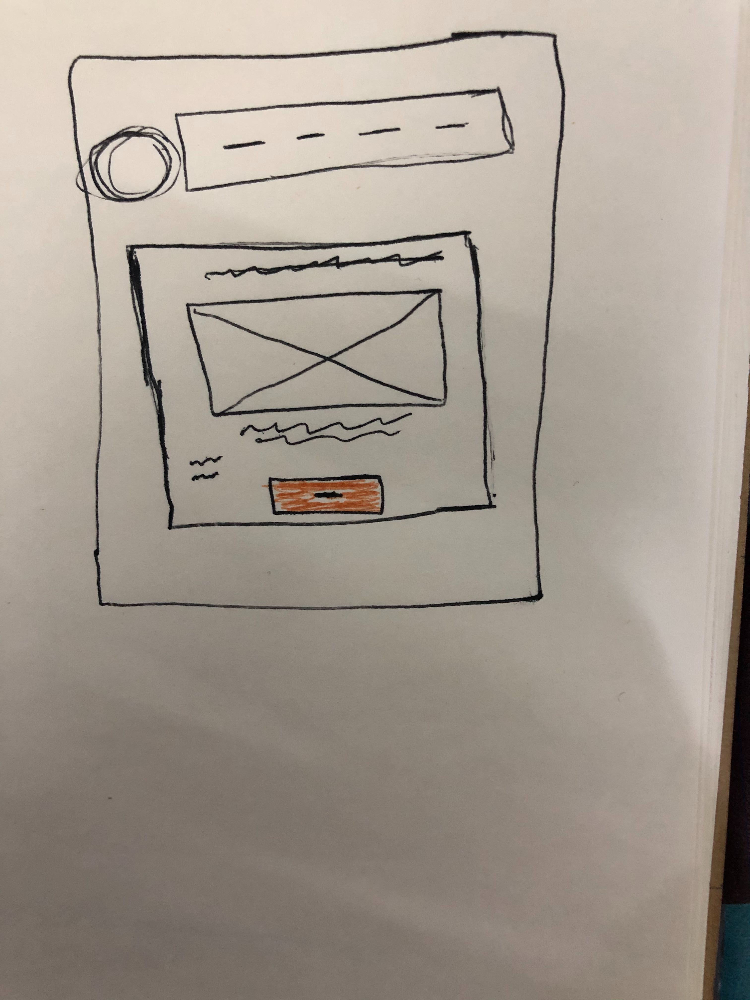

# Website for (News Bitcoin) 
### Go to the websit [GitHub Pages](https://wejdann.github.io/project-2/)
#### The Wireframe :

#### List of technologies :
1. React.
2. JavaScript.
3. BootStrap.
####  The resource :
<i><strong>If you'd like</strong> , [here](https://reactjs.org/tutorial/tutorial.html) and [here](https://getbootstrap.com/docs/4.3/getting-started/introduction/) .

#### Useer Stories :
1. **As a website visitor** , I want to be able to add article to share it with other .
2. **As a website visitor**, I want to be able to delete only one article from my Reading list .
3. **As a website visitor** , I want to be able to edit the article from my list to dsiaply it as I want.
4. **As a website visitor** , I want to be able to clear all the articles from my list to empty my list.
5. **As a website visitor**, I want to be able to choose article as(read later) to reach it any time.

###The plan :
##### Personal Development Plan :
1. **My Goals :** Create a website about(News Bitcoin) without error both logical ,and technology.
2. **Objective :** Do all the basic requirement of project.
3. **Resources required :** Keep on training.
4. **Measurement :** Successful .
5. **Deadline :** One week .

#####  problem-solving strategy :
* First draw the initial wireframe to figure out the requirement .
* Write a list of possible (componentes pages ).
* Search for a Free **API** .
* Test the **API** by using (postman)tools.
* Fetch the data **API**  .
* Write the codeing and test it.

#### **future plans :** 
* change the design.

#### My favorite functions
* function ClearAll .